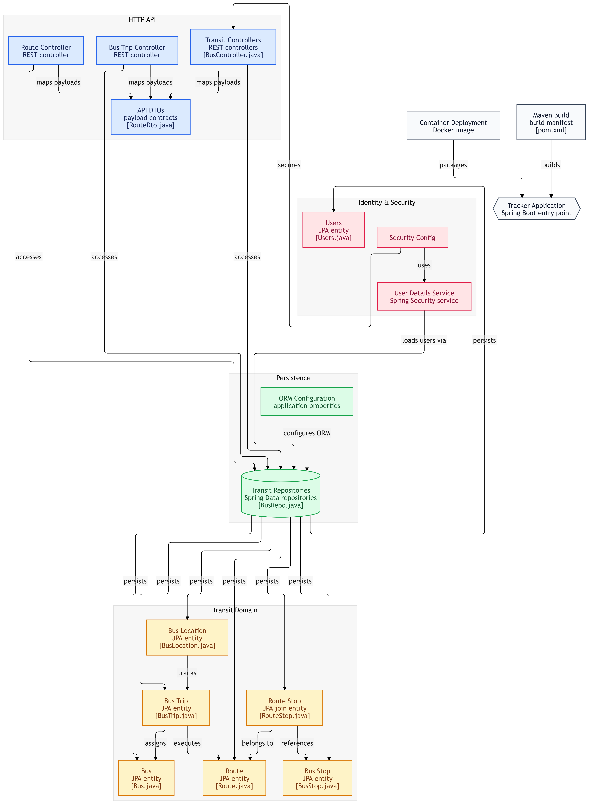
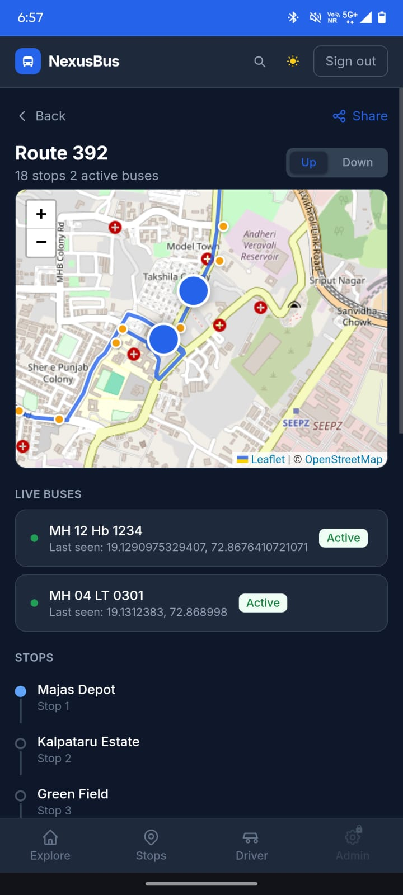
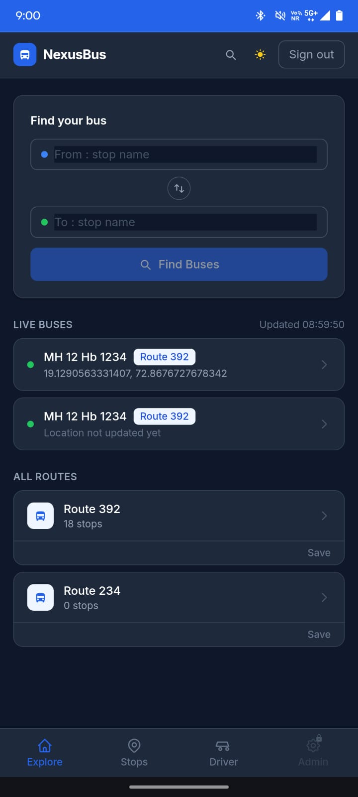
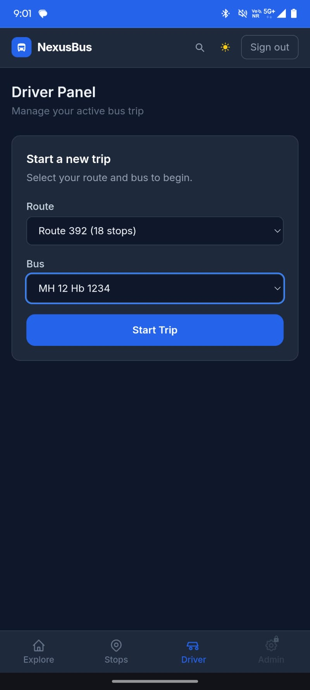
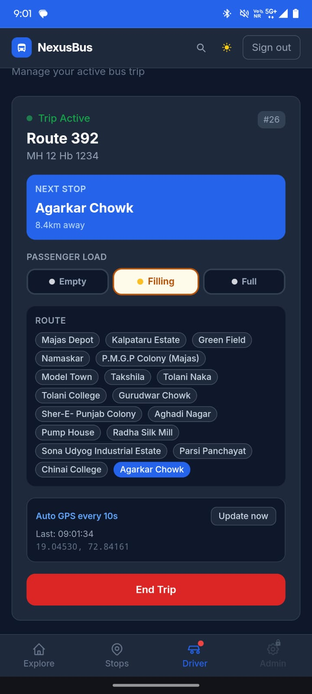
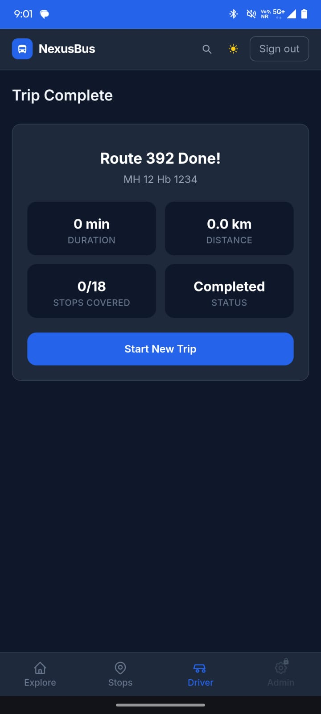
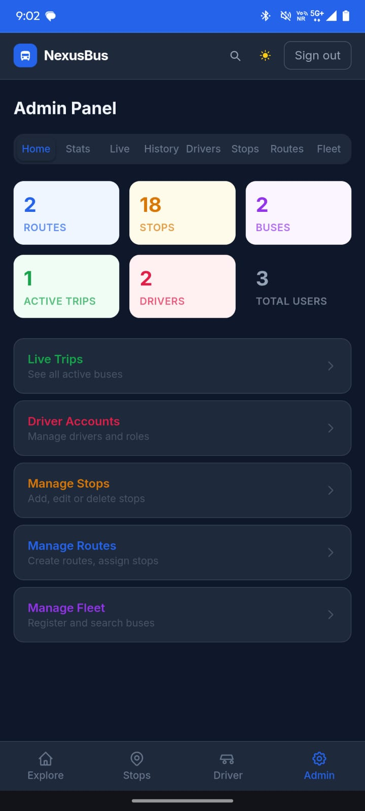

# NexusBus

**Real-Time Bus Tracking Platform Using Smartphone GPS**

NexusBus is a full-stack real-time bus tracking platform that lets passengers discover routes and stops, track active buses, and view estimated arrival times — without requiring any dedicated GPS hardware on the bus itself.

The system uses the driver's smartphone and browser-based GPS to capture and transmit the bus's location. It consists of a **React + Vite** frontend, a **Spring Boot** REST API, and a **PostgreSQL** database, with role-based functionality for passengers, drivers, and administrators.

---

## Table of Contents

- [Overview](#overview)
- [Features](#features)
- [System Architecture](#system-architecture)
- [Backend Implementation](#backend-implementation)
- [Frontend Architecture](#frontend-architecture)
- [Real-Time GPS Tracking](#real-time-gps-tracking)
- [Mapping & Route Visualization](#mapping--route-visualization)
- [ETA Calculation](#eta-calculation)
- [Authentication & Role-Based Access](#authentication--role-based-access)
- [Transit Domain Model](#transit-domain-model)
- [Application Flow](#application-flow)
- [Progressive Web App](#progressive-web-app)
- [Technology Stack](#technology-stack)
- [Key System Parameters](#key-system-parameters)
- [Testing](#testing)
- [Current Limitations](#current-limitations)
- [Future Improvements](#future-improvements)
- [Screenshots](#screenshots)
- [Project Highlights](#project-highlights)

---

## Overview

NexusBus is built around a simple idea: a bus driver already carries a GPS-enabled smartphone, so there is no need for separate GPS hardware.

The driver's browser captures the device's location and periodically sends it to the backend. The backend stores the latest bus location, and passenger clients retrieve that data and render active buses on an interactive map.

```text
Driver Smartphone
       │  GPS Location
       ▼
React Driver Panel
       │  REST API
       ▼
Spring Boot Backend
       │
       ▼
PostgreSQL
       │  Latest Bus Location
       ▼
Passenger React Application
       │
       ▼
Interactive Map
```

---

## Features

### Passenger
- Interactive map with live bus positions
- Browse bus routes and stops
- Search routes and stops
- Find a route between two stops
- View bus and stop locations
- Estimated arrival times (ETA)
- Progressive Web App support
- Theme support (light/dark)
- Automatic map viewport fitting

### Driver
- Driver authentication
- Select bus and route
- Start, manage, and end a trip
- Capture and transmit smartphone GPS location
- Driver profile

No dedicated GPS tracking hardware is required.

### Administrator
- Bus, route, and stop management
- Driver and user management
- Live trip monitoring
- Operational overview
- Role-based administrative access

---

## System Architecture

NexusBus uses a layered full-stack architecture:

```text
┌─────────────────────────────────────────────────────────┐
│                     React Frontend                       │
│   Passenger Pages · Driver Panel · Admin Panel            │
│   React · Vite · React Router · Leaflet · Tailwind CSS     │
└──────────────────────────┬──────────────────────────────┘
                            │ HTTPS / REST API
                            ▼
┌─────────────────────────────────────────────────────────┐
│                  Spring Boot Backend                     │
│   Controllers → DTOs → Repositories → Domain Entities     │
│   Spring Security · JPA · Hibernate                        │
└──────────────────────────┬──────────────────────────────┘
                            │ JPA / SQL
                            ▼
┌─────────────────────────────────────────────────────────┐
│                       PostgreSQL                          │
│   Users · Buses · Routes · Stops · Trips · Locations       │
└─────────────────────────────────────────────────────────┘
```

---

## Backend Implementation

The backend is implemented in Spring Boot with a clean separation between the HTTP API, security, persistence, and the transit domain model.



**Request path:**

```text
HTTP API
    ├── Route Controller
    ├── Bus Trip Controller
    └── Transit Controllers
        │
        ▼
    API DTOs
        │
        ▼
Spring Data Repositories
        │
        ▼
Transit Domain Entities
        │
        ▼
    PostgreSQL
```

**Auth path (handled separately via Spring Security):**

```text
Users → UserDetailsService → Spring Security → Security Configuration
```

The backend is packaged with Maven and can be containerized with Docker.

---

## Frontend Architecture

The frontend is a React single-page application built with Vite.

```text
index.html
    ▼
main.jsx
    ▼
App.jsx
    ├── Layout
    ├── Authentication
    ├── Theme
    └── Application Routes
            ├── Explore
            ├── Search
            ├── Find Route
            ├── Routes
            ├── Route Detail
            ├── Stops
            ├── Stop Detail
            ├── Register
            ├── Driver Profile
            ├── Driver Panel
            └── Admin Panel
```

**Project structure:**

```text
src/
├── api/
│   └── index.jsx
├── components/
│   ├── Layout.jsx
│   ├── MapView.jsx
│   ├── LoginModal.jsx
│   ├── SplashScreen.jsx
│   ├── useToast.js
│   └── ui/
│       └── index.jsx
├── context/
│   ├── AuthContext.jsx
│   └── ThemeContext.jsx
├── pages/
│   ├── Explore.jsx
│   ├── SearchPage.jsx
│   ├── FindRoute.jsx
│   ├── Routes.jsx
│   ├── RouteDetail.jsx
│   ├── Stops.jsx
│   ├── StopDetail.jsx
│   ├── Register.jsx
│   ├── DriverProfile.jsx
│   ├── DriverPanel.jsx
│   └── AdminPanel.jsx
├── App.jsx
├── main.jsx
└── index.css
```

Shared React contexts manage authentication and theme state, while a centralized API module handles all communication with the Spring Boot backend.

---

## Real-Time GPS Tracking

The driver's smartphone acts as the tracking device.

```text
Driver Smartphone
        │  Browser GPS
        ▼
Geolocation API
        │  Latitude / Longitude
        ▼
React Driver Panel
        │  REST API
        ▼
Spring Boot API
        │
        ▼
PostgreSQL (Bus Location)
        │  Latest location
        ▼
Passenger Map
```

The driver app captures the device's position roughly every **10 seconds** and pushes the latest coordinates to the backend.

---

## Mapping & Route Visualization

NexusBus is built entirely on open-source mapping infrastructure:

| Library / Service | Role |
|---|---|
| Leaflet | Interactive map rendering — bus markers, stop markers, route polylines, viewport fitting |
| OpenStreetMap | Underlying geographic map data |
| OSRM | Generates road-following route geometry, rather than straight lines between stops |

```text
Stop A ──────────── Stop B        (naive straight-line connection)

Stop A
   └──┐
      └──┐            OSRM: follows the actual road network
         └──────── Stop B
```

---

## ETA Calculation

Estimated arrival times are derived from the geographic distance between the bus's current position and upcoming stops, using the Haversine formula.

```text
Bus Position → Haversine Distance → Distance / Avg. Speed → Estimated Arrival
```

The current implementation assumes a fixed average speed of **20 km/h**, refreshed periodically, and displays values such as `~8 min`, `~4 min`, or `Arriving soon`.

> **Limitation:** because the average speed is fixed, ETA does not currently account for live traffic, signals, incidents, or unexpected delays.

---

## Authentication & Role-Based Access

NexusBus supports three roles — Passenger, Driver, and Admin — authenticated and authorized via Spring Security.

```text
                     User
          ┌────────────┼────────────┐
          ▼            ▼            ▼
      Passenger      Driver        Admin
          ▼            ▼            ▼
       Public      Driver Panel  Admin Panel
```

Access control is enforced on the backend, not just hidden in the UI, so protected functionality cannot be reached by manipulating the frontend.

---

## Transit Domain Model

```text
                    Route
                      │
                 RouteStop
                  /       \
                 ▼         ▼
              BusStop     Route
                            │
                            ▼
                           Bus
                            │
                            ▼
                         BusTrip
                            │
                            ▼
                      BusLocation
```

| Entity | Purpose |
|---|---|
| `Users` | Authenticated users and their roles |
| `Bus` | A bus in the fleet |
| `Route` | A transit route |
| `BusStop` | A physical bus stop |
| `RouteStop` | Associates stops with routes, in order |
| `BusTrip` | A single bus trip |
| `BusLocation` | Tracked bus location data |

---

## Application Flow

**Passenger:** Open NexusBus → Explore / Search → Select Route → View Route Details → View Stops + Active Buses → Track Bus / View ETA

**Driver:** Login → Driver Panel → Select Bus + Route → Start Trip → Browser GPS → Send Location → Active Trip → End Trip

**Administrator:** Login → Admin Panel → Manage Buses / Routes / Stops / Drivers → Monitor Trips

---

## Progressive Web App

NexusBus supports installation as a Progressive Web App via `vite-plugin-pwa`:

- Installable directly from the browser
- Web app manifest and service worker
- Standalone application mode
- Cached static assets, with no app-store install required

---

## Technology Stack

**Frontend**

| Technology | Purpose |
|---|---|
| React | UI framework |
| Vite | Build tool |
| React Router | Client-side routing |
| Tailwind CSS | Styling |
| Leaflet / React-Leaflet | Interactive maps |
| vite-plugin-pwa | PWA support |
| W3C Geolocation API | Smartphone GPS access |

**Backend**

| Technology | Purpose |
|---|---|
| Java | Backend language |
| Spring Boot | REST API framework |
| Spring Security | Authentication & authorization |
| Spring Data JPA | Persistence |
| Hibernate | ORM |
| Maven | Build & dependency management |

**Database & Infrastructure**

| Technology | Purpose |
|---|---|
| PostgreSQL | Relational database |
| OpenStreetMap | Map data |
| OSRM | Road routing |
| Docker | Containerization |
| Netlify | Frontend deployment |
| Render | Backend deployment |

---

## Key System Parameters

| Parameter | Value |
|---|---|
| GPS update interval | 10 seconds |
| Passenger polling interval | 10 seconds |
| ETA refresh interval | 15 seconds |
| Average ETA speed | 20 km/h |
| GPS mode | High accuracy |
| Routing engine | OSRM |
| Map data | OpenStreetMap |
| Authentication | HTTP Basic Authentication |
| Database | PostgreSQL |

---

## Testing

**Driver:** authentication, bus/route selection, trip start, GPS capture, location transmission, active trip management

**Passenger:** route/stop discovery, active bus visualization, route visualization, ETA display, live location updates

**Administrator:** bus/route/stop management, driver management, trip monitoring, admin workflows

Tested across both desktop and mobile browser environments.

---

## Current Limitations

- **Fixed-speed ETA** — assumes a constant 20 km/h average, so accuracy drops during heavy traffic, signals, incidents, or road closures.
- **Smartphone GPS dependency** — tracking accuracy depends on the driver's device and environment, and degrades in buildings, tunnels, and dense urban areas.
- **Polling-based updates** — passenger clients poll periodically rather than receiving push updates; a future push-based architecture could reduce latency and unnecessary requests.

---

## Future Improvements

- Traffic-aware ETA calculation
- GTFS-Realtime integration
- Push notifications for approaching buses
- GPS failure / dead-reckoning support
- WebSocket/SSE-based real-time updates
- Historical speed analysis
- ETA prediction using historical trip data
- Marathi, Hindi, and English localization

---

## Screenshots

| Bus Tracking | Search Bus |
|---|---|
|  |  |

| Driver — Start Trip | Driver — Ongoing Trip |
|---|---|
|  |  |

| Driver — End Trip | Admin Panel |
|---|---|
|  |  |

---

## Project Highlights

- Full-stack development with React, Spring Boot, and PostgreSQL
- REST API design with Spring Security and role-based access control
- Spring Data JPA persistence layer
- Browser-based GPS tracking with no dedicated hardware
- Haversine-based geographic distance and ETA calculation
- Interactive mapping with Leaflet, OpenStreetMap, and OSRM road routing
- Progressive Web App support
- Docker-based containerization and cloud deployment (Netlify + Render)

The core engineering idea is to use the smartphone the driver already carries as the bus's GPS tracking device, eliminating the need for dedicated tracking hardware.

---

### Repository Structure

```text
NexusBus/
├── README.md
├── docs/
│   ├── backend-architecture.png
│   └── screenshots/
│       ├── bus-tracking.jpg
│       ├── search-bus.jpg
│       ├── driver-start-trip.jpg
│       ├── driver-ongoing-trip.jpg
│       ├── driver-end-trip.jpg
│       └── admin.jpg
├── frontend/
└── backend/
```
